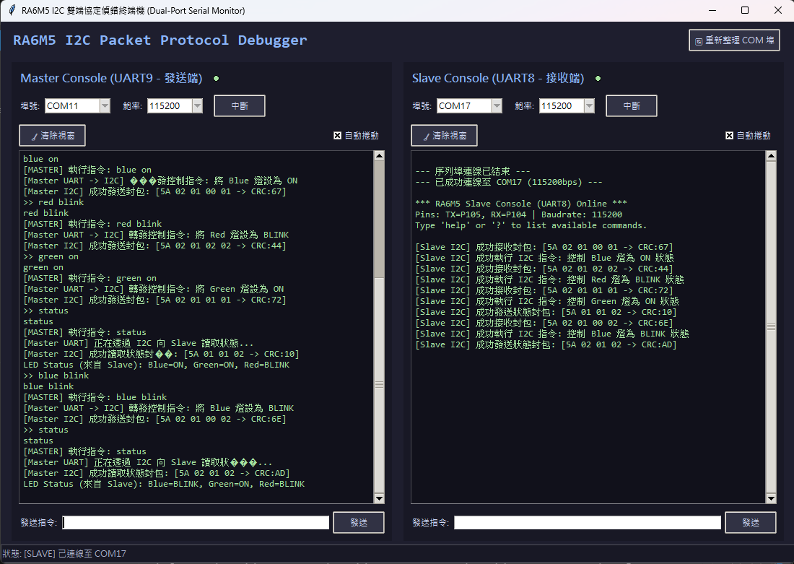

# RA6M5 單板 I2C Master-Slave 雙向通訊 LED 控制與狀態查詢系統

本專案實作於瑞薩 (Renesas) RA6M5 微控制器，在**單塊開發板上**透過硬體迴路 (Loopback)，將 IIC0 (設定為 Master) 與 IIC1 (設定為 Slave) 連接，建立基於自訂封包格式及 CRC8 校驗的安全傳輸協定。
本系統支援透過串列控制台下達 LED 指令，控制 Slave 端接腳的 LED 狀態（恆亮、熄滅、閃爍），並支援 Master 透過 I2C 主動向 Slave 查詢 LED 燈號的真實狀態。
專案亦配備了一個專屬的 Python Tkinter 雙埠序列偵錯終端機，可實時觀測 Master 與 Slave 兩端的互動細節。

---

## 📌 系統接線定義 (Pin Configuration)

為了在單板上實現 Master 到 Slave 的 Loopback 通訊，請按照以下定義進行硬體接線：

### 1. I2C 匯流排 (IIC Loopback) 連接
*   **IIC0 (Master)**
    *   SCL0 接腳：`P400`
    *   SDA0 接腳：`P401`
*   **IIC1 (Slave)**
    *   SCL1 接腳：`P512`
    *   SDA1 接腳：`P511`
*   **硬體接線方式**：
    *   將 `P400 (SCL0)` 與 `P512 (SCL1)` 對接。
    *   將 `P401 (SDA0)` 與 `P511 (SDA1)` 對接。
    *   ⚠️ **重要提醒**：由於 RA6M5 的 I2C 腳位工作在開路汲極 (Open-Drain) 模式下，**必須在 SCL 與 SDA 訊號線上外接上拉電阻**（推薦使用 $4.7\text{ k}\Omega$ 上拉至 3.3V），否則訊號無法拉高，通訊會出現逾時或匯流排錯誤。

### 2. 實體 LED 輸出 (GPIO)
由 Slave 端的韌體控制以下接腳，以對應 LED 狀態：
*   **藍燈 (Blue LED)**：`P006` (高電平點亮)
*   **綠燈 (Green LED)**：`P007` (高電平點亮)
*   **紅燈 (Red LED)**：`P008` (高電平點亮)

### 3. UART 序列埠控制台 (SCI UART)
*   **Master 終端 (UART9)**
    *   TX 接腳：`P109`
    *   RX 接腳：`P110`
    *   鮑率設定：`115200 bps`, `8N1`, 無硬體流控
*   **Slave 終端 (UART8)**
    *   TX 接腳：`P105`
    *   RX 接腳：`P104`
    *   鮑率設定：`115200 bps`, `8N1`, 無硬體流控

---

## 🛠️ 韌體架構與功能 (Firmware Architecture)

韌體採用 Bare-metal 架構實作，配合瑞薩 FSP (Flexible Software Package) 驅動層。

1.  **非阻塞雙串列控制台 (`uart_console.c`, `ring_buffer.c`)**
    *   利用環形緩衝區實作非阻塞的字元接收與發送。
    *   UART 中斷僅將字元推入或自緩衝區取出，主迴圈中輪詢重組指令並印出。
    *   支援指令清單：
        *   `help` / `?`：顯示可用指令說明。
        *   `blue [on|off|blink]` / `b1` / `b0` / `bb`：控制藍燈狀態。
        *   `green [on|off|blink]` / `g1` / `g0` / `gb`：控制綠燈狀態。
        *   `red [on|off|blink]` / `r1` / `r0` / `rb`：控制紅燈狀態。
        *   `status`：查詢當前三色 LED 的狀態。

2.  **I2C 封包通訊協定 (`i2c_packet_protocol.h`, `crc8.c`)**
    *   所有通訊均打包為自訂的封包格式，並透過 CRC8 (計算多項式 $X^8 + X^2 + X + 1$) 校驗：
        *   **控制指令封包** (共 6 位元組)：
            `Header (0x5A) | Length (0x02) | Command (0x01) | Color (1 byte) | Mode (1 byte) | CRC8 (1 byte)`
        *   **狀態回傳封包** (共 5 位元組)：
            `Header (0x5A) | BlueState (1 byte) | GreenState (1 byte) | RedState (1 byte) | CRC8 (1 byte)`

3.  **I2C Master 功能 (`i2c_master.c`)**
    *   提供 `i2c_master_send_led_cmd()`，將控制指令打包為封包並發起 `R_IIC_MASTER_Write` 傳送至 Slave。
    *   提供 `i2c_master_read_status()`，發起 `R_IIC_MASTER_Read` 讀取狀態，並對接收資料進行 CRC8 校驗，確保資料正確性。

4.  **I2C Slave 功能 (`i2c_slave.c`)**
    *   **大緩衝區一次性讀取**：由於 FSP 中關閉了時鐘延展 (Clock Stretching) 功能，為避免逐字元讀取速度跟不上 Master 時鐘而造成過載錯誤 (Data Overrun)，Slave 在接收中斷中，以單次大緩衝區讀取整個封包。
    *   **異步傳送日誌機制**：為確保 I2C 中斷服務函式 (ISR) 的即時性，Slave 發送狀態時，不直接在 ISR 內呼叫 UART 列印，而是拷貝資料至暫存區並置位標記，改在主迴圈 `i2c_slave_process` 異步列印發送結果，保證系統的穩定度。

---

## 🖥️ PC 端 GUI 偵錯工具 (UI Monitor)

本專案附帶 PC 端視覺化調試程式 `uart_monitor.py`，基於 Python Tkinter 與 `pyserial` 開發。

*   **雙欄獨立顯示**：左右分欄分別連接 Master (UART9) 與 Slave (UART8)，一目了然觀測雙端互動。
*   **連線指示燈**：紅/綠雙色圓形燈顯示當前 COM 埠的連線狀態。
*   **動態重整**：一鍵刷新並檢測目前電腦上可用的 COM 埠，支援多種常見鮑率。
*   **終端控制功能**：
    *   提供「🧹 清除視窗」功能，便於重新觀察特定測試結果。
    *   可選擇是否開啟「自動捲動」。
    *   編碼容錯解碼，防止字元亂碼導致程式崩潰。
*   **便捷發送**：輸入指令後點選「發送」或按下鍵盤 **Enter** 鍵即可送出。

---

## 🚀 開發與驗證順序 (Development & Verification Phases)

專案採用漸進式的開發模式，並於每個關鍵節點進行驗證，確保邏輯的正確與硬體的穩定：

### Phase 1: 基礎配置與外設打通
*   **實作**：使用 e2 studio 進行引腳配置與代碼生成。設定 UART8、UART9、IIC0 (Master) 及 IIC1 (Slave)。
*   **驗證**：撰寫簡單的雙向 Heartbeat 心跳發送功能（初版每秒發送），透過串行埠助手，確認開發板的 UART8 與 UART9 可以正常向 PC 端輸出，且 LED 腳位可正常輸出高低電平。

### Phase 2: Python 偵錯工具開發
*   **實作**：實作 `uart_monitor.py` 雙欄 Tkinter 介面。
*   **驗證**：開啟兩個虛擬序列埠對接，驗證連線中斷、數據佇列、自動捲動及發送指令按鈕的回顯邏輯無誤。

### Phase 3: 非阻塞式控制台實作
*   **實作**：引入 `ring_buffer` 實作非阻塞式收發與 Echo 回顯。
*   **驗證**：利用 `uart_monitor.py` 分別向 Master 與 Slave 傳送指令，並確認能印出相應的執行結果與 `help` 選單。

### Phase 4: Master 封包封裝與 I2C 單向控制實作
*   **實作**：撰寫 `crc8` 校驗庫與 `i2c_master` 的控制打包函式。實作 Slave 端一次性接收快取。
*   **驗證 (無上拉電阻)**：初次測試時遇到 Master 讀寫逾時與 Abort 錯誤。
*   **驗證 (硬體排除)**：對 SDA/SCL 訊號線加上 4.7K 外接上拉電阻，通訊成功打通。此時在 Master 端輸入 `blue blink`，Master 會封裝為 `5A 02 01 00 02 6E` (CRC 正確) 並透過 I2C 發送。Slave 端成功接收並解析指令，點亮實體板上的藍色 LED 閃爍。

### Phase 5: 雙向狀態查詢與安全日誌輸出 (當前階段)
*   **實作**：Master 追加 `status` 查詢，發送 I2C Read 指令要求 5 位元組；Slave 中斷監聽到讀取要求，動態讀取三色 LED 狀態打包為回傳封包送回，並由主迴圈異步列印發送日誌。
*   **驗證**：
    *   在 Master (COM11) 輸入 `status`，Master 透過 I2C 發起讀取。
    *   Slave (COM17) 回傳狀態，並在終端顯示 `[Slave I2C] 成功發送狀態封包...`。
    *   Master 接收並校驗 CRC8 後，成功在終端解碼顯示：`LED Status (來自 Slave): Blue=BLINK, Green=OFF, Red=OFF`，與實際狀態完全吻合。

---

## 📄 檔案目錄結構

*   `uart_monitor.py`：PC 端雙埠串列偵錯 Tkinter 程式
*   `I2C_SP/src/`：RA6M5 開發板原始碼
    *   `hal_entry.c`：主程式進入點，初始化硬體並驅動主輪詢迴圈
    *   `uart_console.h` / `.c`：非阻塞式控制台與 LED 控制邏輯
    *   `ring_buffer.h` / `.c`：基礎環形緩衝區實作
    *   `i2c_packet_protocol.h`：自訂 I2C 封包協定結構與 Command ID 定義
    *   `crc8.h` / `.c`：CRC8 校驗計算函式庫
    *   `i2c_master.h` / `.c`：Master 發送指令與讀取狀態實作
    *   `i2c_slave.h` / `.c`：Slave 中斷大快取接收、回應狀態與異步列印日誌
*   `readme.md`：本說明文件
