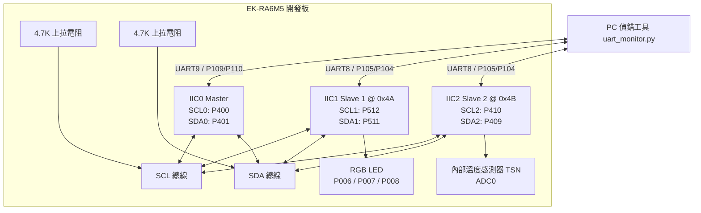

# RA6M5 I2C 一主多從雙向通訊與 TSN 溫度讀取系統

本專案在瑞薩 (Renesas) RA6M5 微控制器上，透過硬體迴路 (Loopback) 將 IIC0 (Master)、IIC1 (Slave 1) 與 IIC2 (Slave 2) 連接於同一條 I2C 匯流排上，實作自訂封包格式與 CRC8 校驗的通訊。

## 功能特徵
* **LED 控制 (Slave 1 @ 0x4A)**：Master 透過 I2C 指令控制 Slave 1 的三色 LED 狀態（開啟、關閉、閃爍）並查詢其狀態。
* **TSN 溫度讀取 (Slave 2 @ 0x4B)**：Slave 2 透過暫存器控制MCU的溫度感測器 (TSN)，並計算出溫度。Master 可動態切換位址讀取該溫度。
* **I2C 總線掃描 (Bus Scanner)**：Master 可掃描 `0x08 ~ 0x77` 的位址，偵測總線上活動的裝置並統計數量。
* **USB PHID 鍵盤模擬**：透過 USB 埠連接電腦並模擬為標準鍵盤，在按下 S1 (P005) 或 S2 (P004) 實體按鍵時自動輸入對應的字串。
* **雙埠序列偵錯工具**：提供 Python Tkinter 介面連接 Master 與 Slave 兩端的序列埠。

---

## 系統接線定義

請將三組 I2C 的 SCL/SDA 訊號線並聯，並外接上拉電阻。



### 1. I2C 共享匯流排連接
* **IIC0 (Master)**：SCL0 = `P400`，SDA0 = `P401`
* **IIC1 (Slave 1)**：SCL1 = `P512`，SDA1 = `P511`
* **IIC2 (Slave 2)**：SCL2 = `P410` (J24-10)，SDA2 = `P409` (J24-9)
### 2. LED 腳位 (Slave 1 控制)
* 藍燈：`P006`，綠燈：`P007`，紅燈：`P008`

### 3. UART 序列埠
* **Master (UART9)**：TX = `P109`，RX = `P110`（115200, 8N1）
* **Slave (UART8)**：TX = `P105`，RX = `P104`（115200, 8N1，Slave 1 與 Slave 2 共用）

### 4. USB 埠與實體按鍵 (HID 鍵盤模擬)
* **USB 介面**：使用開發板的 USB 埠連接電腦進行模擬。
* **按鍵 S1 (P005)**：按下觸發模擬鍵盤輸入 `"input_s1"`。
* **按鍵 S2 (P004)**：按下觸發模擬鍵盤輸入 `"input_s2"`。

---

## 支援指令列表

在終端機中，支援以下指令：

```text
====== 支援指令列表 ======
  blue [on|off|blink]  - 控制藍燈(P006)
  green [on|off|blink] - 控制綠燈(P007)
  red [on|off|blink]   - 控制紅燈(P008)
  status               - 查詢狀態 (LED / TSN 溫度)
  readreg <reg>        - 讀取特定暫存器值 (Hex/Dec)
  writereg <reg> <val> - 寫入特定暫存器值
  dumpreg              - 傾印所有暫存器狀態
  regmap               - 顯示暫存器圖譜樹狀圖
  tsn                  - 讀取 MCU 真實內部溫度 (TSN，僅限 Master 端執行)
  scan                 - 掃描 I2C 總線裝置 (0x08 ~ 0x77，僅限 Master 端執行)
==========================
```

---

## I2C 通訊協定與暫存器定義

### 1. 封包格式
* **LED 控制指令封包** (6 bytes)：
  `Header (0x5A) | Length (0x02) | Command (0x01) | Color (1 byte) | Mode (1 byte) | CRC8 (1 byte)`
* **LED 狀態回傳封包** (5 bytes)：
  `Header (0x5A) | BlueState (1 byte) | GreenState (1 byte) | RedState (1 byte) | CRC8 (1 byte)`
* **TSN 溫度回傳封包** (5 bytes)：
  `Header (0x5A) | Temp_Integer (1 byte) | Temp_Decimal (1 byte) | Reserved (0x00) | CRC8 (1 byte)`

### 2. Slave 1 虛擬暫存器映射
透過 I2C 指令可對以下暫存器進行讀寫：

| 暫存器位址 | 暫存器名稱 | 權限 | 預設值 | 說明 |
| :--- | :--- | :--- | :--- | :--- |
| `0x00` | `DEVICE_ID` | RO | `0xA5` | 裝置 ID |
| `0x01` | `FW_VERSION` | RO | `0x01` | 韌體版本 |
| `0x02` | `BLUE_STATE` | RW | `0x00` | 藍色 LED 狀態 (`0`: OFF, `1`: ON, `2`: BLINK) |
| `0x03` | `GREEN_STATE`| RW | `0x00` | 綠色 LED 狀態 (`0`: OFF, `1`: ON, `2`: BLINK) |
| `0x04` | `RED_STATE`  | RW | `0x00` | 紅色 LED 狀態 (`0`: OFF, `1`: ON, `2`: BLINK) |
| `0x10` | `RX_PACKETS` | RO | `0x00` | 成功接收的 I2C 封包數 |
| `0x11` | `CRC_FAILS`  | RO | `0x00` | CRC8 校驗失敗次數 |
| `0x12` | `LAST_ERROR` | RO | `0x00` | 上次封包錯誤碼 (`0`:NONE, `1`:BAD_CRC, `2`:BAD_HEADER, `3`:BAD_LEN) |
| `0x13` | `LAST_CMD`   | RO | `0x00` | 上次執行的指令 ID |

在終端機中執行 `regmap` 時的樹狀圖輸出格式：

```text
Slave 1 (0x4A) Register Map Tree:
├── System Registers
│   ├── [0x00] DEVICE_ID   (RO) = 0xA5  [Device ID]
│   └── [0x01] FW_VERSION  (RO) = 0x01  [Firmware Version]
├── LED Control Registers (RW)
│   ├── [02] BLUE_STATE  (RW) = 0 (OFF)  [Blue LED state]
│   ├── [03] GREEN_STATE (RW) = 0 (OFF)  [Green LED state]
│   └── [04] RED_STATE   (RW) = 0 (OFF)  [Red LED state]
└── Diagnostics & Statistics
    ├── [0x10] RX_PACKETS  (RO) = 0  [Valid custom packets count]
    ├── [0x11] CRC_FAILS   (RO) = 0  [CRC8 verification failures]
    ├── [0x12] LAST_ERROR  (RO) = NONE  [Last packet error state]
    └── [0x13] LAST_CMD    (RO) = 0x00  [Last executed Command ID]
```
## PC 端 GUI 偵錯工具

本專案附帶 PC 端序列埠調試程式 `uart_monitor.py`，基於 Python Tkinter 與 `pyserial` 開發。


* **雙欄顯示**：左右分欄分別連接 Master (UART9) 與 Slave (UART8)。
* **連線指示**：圓形燈顯示 COM 埠連線狀態。
* **動態重整**：可刷新並檢測可用的 COM 埠。
* **發送與 Echo**：輸入指令後點選「發送」或按下 Enter 鍵送出。

---

## 檔案目錄結構

* `uart_monitor.py`：PC 端雙埠序列埠偵錯 Tkinter 程式
* `I2C_SP/src/`：RA6M5 開發板原始碼
  * `hal_entry.c`：主程式進入點，初始化硬體並執行主輪詢迴圈
  * `uart_console.h` / `.c`：控制台與指令解析
  * `ring_buffer.h` / `.c`：環形緩衝區實作
  * `i2c_packet_protocol.h`：自訂 I2C 封包協定與暫存器定義
  * `crc8.h` / `.c`：CRC8 校驗計算
  * `i2c_master.h` / `.c`：Master 發送指令、讀取狀態與 I2C 總線掃描實作
  * `i2c_slave.h` / `.c`：Slave 1 (LED 控制) 中斷接收、回應狀態與日誌輸出
  * `i2c_slave2.h` / `.c`：Slave 2 (TSN 遙測) 溫度計算、封包回應與掃描同步處理
  * `usb_phid_control.h` / `.c`：USB PHID 控制與按鍵掃描狀態機
  * `r_usb_phid_descriptor.c`：USB PHID 鍵盤報告與各級描述子定義
